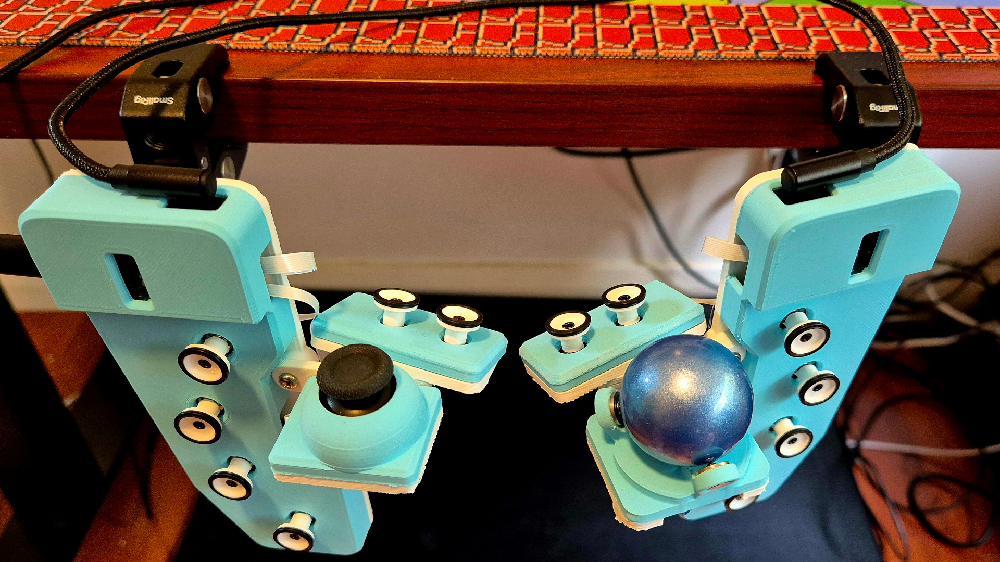
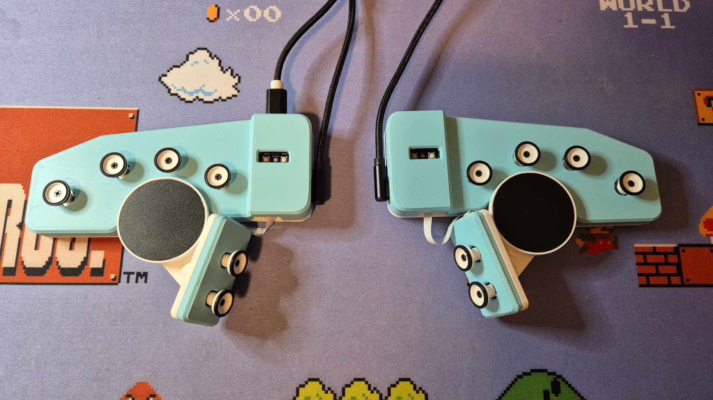
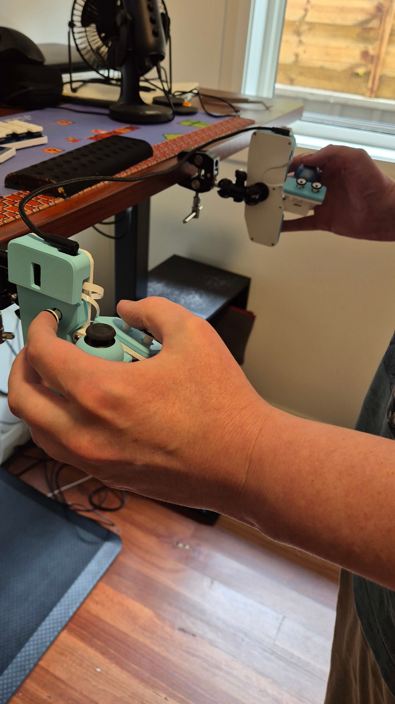
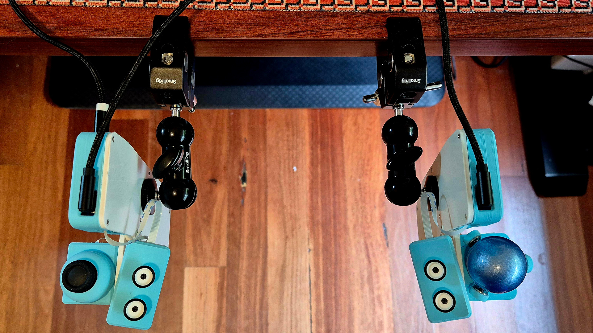
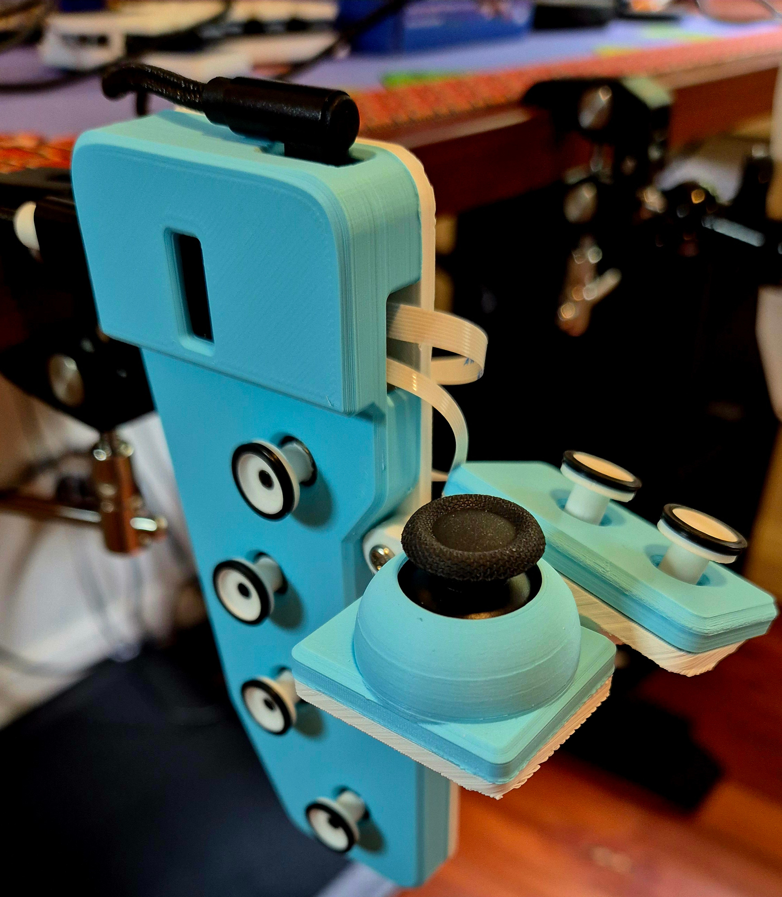
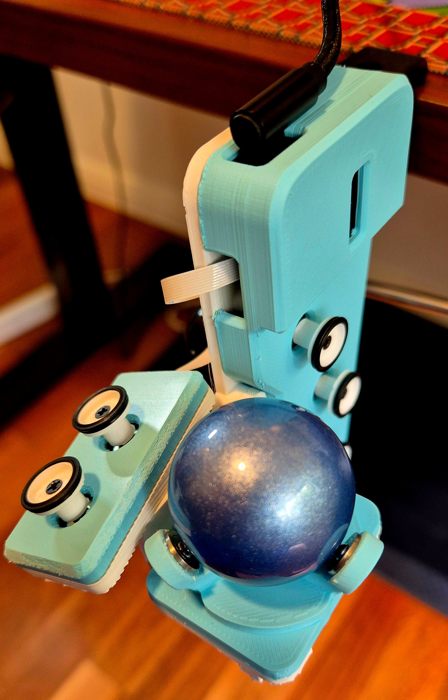
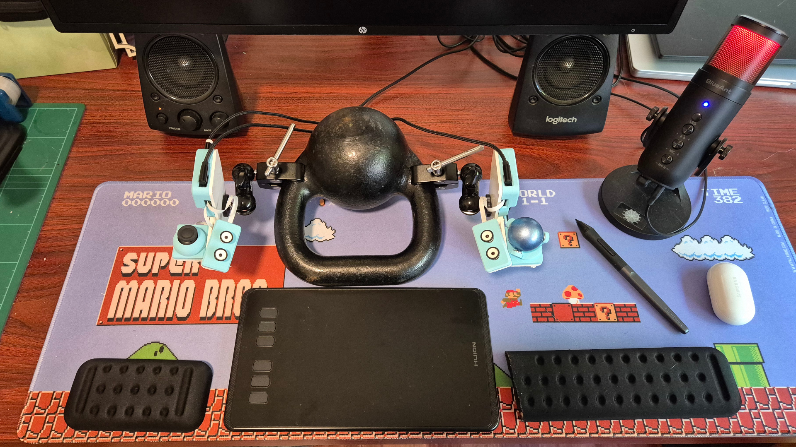
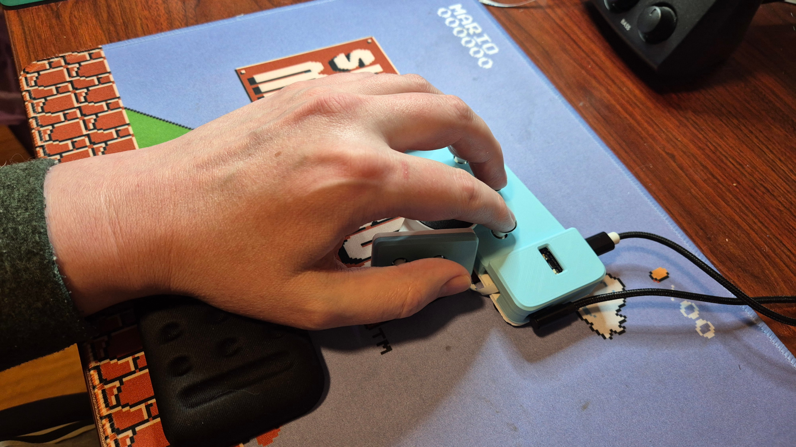

# Harite v2 Directional keyboard

All the features of [Harite v1](https://github.com/dlip/harite) plus:

- A modular thumb cluster which allows for various devices including thumbsticks, trackballs, trackpads and extra 5 way switches
- 1/4-20 camera mount compatible nuts for flexible tenting orientations
- 3D models created using FreeCAD to avoid proprietary software use

To make your own, follow the [build guide](./build.md)

## Gallery

[Typing video](https://youtu.be/VckVijPMjfQ)

[YouTube video of playing Doom with Harite v2](https://youtu.be/kz_-oAf_KqY)
