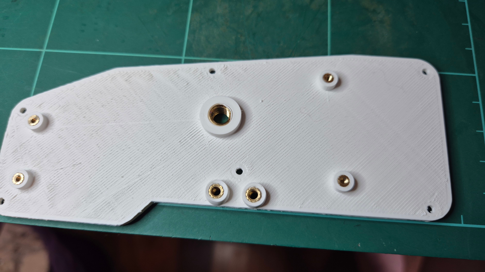

# Harite v2 Build Guide

## Firmware

- QMK
  - [Official Repo](https://github.com/qmk/qmk_firmware/tree/master/keyboards/dlip/haritev2)
  - [My fork with 'Stained' layout](https://github.com/dlip/qmk_firmware/tree/dlip/keyboards/dlip/haritev2/dual_cirque/keymaps/stained)
  - [Vial](https://github.com/vial-kb/vial-qmk/tree/vial/keyboards/dlip/haritev2/dual_cirque/keymaps/vial)

## Vertical thumbstick + trackball configuration

### Parts

|  Name                                                    | Qty    | Notes                                                                                                                                                                                                     |
| ---------------------------------------------------- | --- | ---------------------------------------------------------------------------------------------------------------------------------------------------------------------------------------------------- |
| Left PCB                                             | 1   | Order using files in kicad/left/gerber_to_order                                                                                                                                                      |
| Right PCB                                            | 1   | Order using files in kicad/right/gerber_to_order                                                                                                                                                     |
| Thumb cluster PCB                                    | 2   | Order using files in kicad/thumb-cluster/gerber_to_order                                                                                                                                             |
| Thumbstick Breakout PCB                              | 1   | Order using files in kicad/thumbstick-breakout/gerber_to_order                                                                                                                                       |
| PMW3389 Motion Sensor                                | 1   | [https://www.tindie.com/products/citizenjoe/pmw3389-motion-sensor/](https://www.tindie.com/products/citizenjoe/pmw3389-motion-sensor/)                                                               |
| 1/4-20 8mm OD 6mm height Knurled Insert Nut          | 2   | For camera mounts <https://www.aliexpress.com/item/1005005225137961.html>                                                                                                                              |
| Smallrig clamp and ball mount                        | 2   | <https://www.amazon.com.au/SmallRig-Ballhead-Multi-Function-Adapter-Ronin-M/dp/B08C2W7SK6/>                                                                                                            |
| M3 knurled insert nuts 6mm length 4.2 OD             | 2   | For thumb cluster mount                                                                                                                                                                              |
| m3*6 screws                                          | 2   | For thumb cluster mount                                                                                                                                                                              |
| M2 knurled insert nuts 3mm length 3.5mm OD           | 36  | 24 for cases and 12 for switch caps [https://www.aliexpress.com/item/1005003582355741.html](https://www.aliexpress.com/item/1005003582355741.html)                                                   |
| M2*4 screw                                           | 12  | for switch caps                                                                                                                                                                                      |
| M2*5 screw                                           | 8   | for base pcb                                                                                                                                                                                         |
| M2*5 screw                                           | 2   | for PMW3389 pcb mount                                                                                                                                                                                |
| M2*6 screw                                           | 12  | for main case                                                                                                                                                                                        |
| M2*6 screw                                           | 16  | for thumb cluster cases                                                                                                                                                                              |
| 1N4148 SOD-123 Diodes                                | 60  |                                                                                                                                                                                                      |
| 5 pin FFC connector Amphenol IIC 59453-051110ECHLF   | 1   | For joystick [https://www.digikey.com.au/en/products/detail/amphenol-cs-fci/59453-051110ECHLF/4272135](https://www.digikey.com.au/en/products/detail/amphenol-cs-fci/59453-051110ECHLF/4272135)      |
| 5 pin FFC cable type-A 0.5 pitch 10cm length         | 1   | For joystick [https://www.aliexpress.com/item/1005006274471212.html](https://www.aliexpress.com/item/1005006274471212.html)                                                                          |
| 8 pin FFC connector Amphenol IIC 59453-081110EDHLF   | 2   | For thumb cluster [https://www.digikey.com.au/en/products/detail/amphenol-cs-fci/59453-081110EDHLF/4272146](https://www.digikey.com.au/en/products/detail/amphenol-cs-fci/59453-081110EDHLF/4272146) |
| 8 pin FFC cable type-A 0.5 pitch 5cm length          | 2   | For Thumb cluster [https://www.aliexpress.com/item/1005006274471212.html](https://www.aliexpress.com/item/1005006274471212.html)                                                                     |
| RP2040-Zero controller with headers 2.5mm height     | 2   |                                                                                                                                                                                                      |
| SKRHADE010 5-way switches                            | 12  | [https://www.aliexpress.com/item/1005008022179292.html](https://www.aliexpress.com/item/1005008022179292.html)                                                                                       |
| PS5 hall effect joystick                             | 1   | [https://www.aliexpress.com/item/1005006282848536.html](https://www.aliexpress.com/item/1005006282848536.html)                                                                                       |
| PS5 thumbstick cap                             | 1   | [https://www.aliexpress.com/item/1005006565311749.html](https://www.aliexpress.com/item/1005006565311749.html)                                                                                       |
| HRO TYPE-C-31-M-12 USB C female ports                |     |                                                                                                                                                                                                      |
| USB-C to USB-C cable                                 | 1   | To connect halves                                                                                                                                                                                    |
| USB-C to USB-A/C cable                               | 1   | To connect to pc                                                                                                                                                                                     |
| Super glue and toothpicks for joystick stems         | 1   |                                                                                                                                                                                                      |
| X-Ring of thickness 1.78mm and inner diameter 6.75mm | 12  | <https://www.aliexpress.com/item/1005006039394059.html>                                                                                                                                                |
| 34mm trackball                                       | 1   | <https://www.amazon.com.au/Perixx-PERIPRO-303GR-Trackball-Glossy-Compatible/dp/B071NX7Y2J?th=1>                                                                                                        |
| BTU bearings (Veichu VCN310, 7.5mm)                  | 3   | [https://www.aliexpress.com/item/1005003066404497.html](https://www.aliexpress.com/item/1005003066404497.html)                                                                                       |
| Left case base | 1 | [./freecad/left-casebase.stl](./freecad/left-casebase.stl) |
| Right case base | 1 | [./freecad/right-casebase.stl](./freecad/right-casebase.stl) |
| Left case top | 1 | [./freecad/left-casetop.stl](./freecad/left-casetop.stl) |
| Right case top | 1 | [./freecad/right-casetop.stl](./freecad/right-casetop.stl) |
| Left thumb mount for thumbstick and thumb cluster | 1 | [./freecad/left-thumb-mount-verticalthumbstick-and-thumb-cluster.stl](./freecad/left-thumb-mount-verticalthumbstick-and-thumb-cluster.stl) |
| Right thumb mount for trackball and thumb cluster | 1 | [./freecad/right-thumb-mount-verticaltrackball-and-thumb-cluster.stl](./freecad/left-thumb-mount-verticalthumbstick-and-thumb-cluster.stl) |
| Thumb cluster top| 2 | [./freecad/thumb-cluster-thumb-clustertop.stl](./freecad/thumb-cluster-thumb-clustertop.stl) |
| Thumbstick top| 1 | [./freecad/thumbstick-breakout-casetop.stl](./freecad/thumbstick-breakout-casetop.stl) |
| Trackball BTU top| 1 | [./freecad/trackball-holder-top-btubtu top.stl](./freecad/trackball-holder-top-btubtu%20top.stl) |
| Switch stems | 12 | [./freecad/caps-stem.stl](./freecad/caps-stem.stl)|
| Switch X-Ring caps | 12 | [./freecad/caps-xring.stl](./freecad/caps-xring.stl)|

### Building

- Assemble the PCB in basically the same way as the [Harite v1 build guide](https://github.com/dlip/harite/blob/main/build.md)
- Connect the PMW3389 PCB with insulated wire
- Solder the FFC connectors - One 8 pin on each side and one 5 pin on the left side

- The switch thumb cluster is built in a similar way, with a 8 pin FFC connector

- Solder the thumbstick onto the pcb with a 5 pin FFC connector and attach cap

- When building the case insert the knurled nuts as shown

> please ignore the thumb mount spacing from and eariler prototype

- Screw on main PCB, the case top, switch caps and thumb mount with M3 screws
- Melt M2 knurled nuts into trackball holder and screw on PMW3389 pcb
- Attach the thumb cluster pcb with FFC cable

- Insert BTU into trackball holder top, melt in M2 knurled nuts and screw on with M2*5 screws
- Place thumb cluster in tray, melt in M2 knurled nuts to the top case and screw on with M2*5 screws

- Attach the thumbstick in a similar manner

- Done! Welcome to team Harite!

## Horizontal Dual Cirque configuration

### Parts

|  Name                                                    | Qty    | Notes                                                                                                                                                                                                     |
| ---------------------------------------------------- | --- | ---------------------------------------------------------------------------------------------------------------------------------------------------------------------------------------------------- |
| Cirque 40mm Trackpads TM040040-2024-302 with flat overlay | 2   | <https://au.mouser.com/ProductDetail/Cirque/TM040040-2024-302>  |
| 12 pin FFC connector Amphenol IIC 59453-121110ECHLF | 2   | For cirque [https://www.digikey.com.au/en/products/detail/amphenol-cs-fci/59453-121110ECHLF/4272151](https://www.digikey.com.au/en/products/detail/amphenol-cs-fci/59453-121110ECHLF/4272151)      |
| 12 pin FFC cable type-A 0.5 pitch 5cm length          | 2   | For cirque [https://www.aliexpress.com/item/1005006274471212.html](https://www.aliexpress.com/item/1005006274471212.html)                                                                     |
| Rubber feet 1cm diameter or less  | 14   |   |
| Left thumb mount for thumbstick and thumb cluster  | 1 | [./freecad/left-thumb-mount-horizontalcirque-and-thumb-cluster.stl](./freecad/left-thumb-mount-horizontalcirque-and-thumb-cluster.stl)|
| Right thumb mount for thumbstick and thumb cluster  | 1 | [./freecad/left-thumb-mount-horizontalcirque-and-thumb-cluster.stl](./freecad/right-thumb-mount-horizontalcirque-and-thumb-cluster.stl)|

### Building

- Solder 12 pin connector to main pcb and connect cirque to test (Some Firmware changes may be necessary)

- Connect mount with thumb cluster

- Add rubber feet

